# ISS Tracker & Quiz
## Track the ISS in real time while you to try beat the quiz.

> Live site available here: [ISS Tracker](https://ksheridan86.github.io/project-2-ISS-tracker-quiz/index.html)

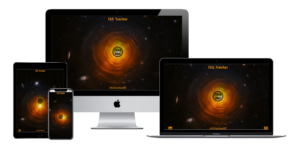

## Table of Contents

- [Description](#description)
- [Theme](#theme)
- [Features](#features)
- [Testing](#testing)
- [Technologies](#technologies)
- [Deployment](#cloning)
- [Credits](#credits)
- [Acknowledgements](#acknowledgements)
- [Author Info](#author-info)

------

## Description
This project was designed to be fun, the map provides a real time view of the ISS on it's path around Earth.
But it should also give information and test the users knowledge of the International Space Station. 
The information provided is basic, the quiz questions will give a user who is familiar with the ISS aswell as a user who has never heard of the ISS a brief understanding of what it is, what it does, it's many achievements and hopefully encourage them to seek out some more information themselves.

------
## Theme 

The theme choosen for this site was Space and Technology, the main question I considered at every step was:

`Is it
Minimal, Clean, Slick, Professional?`

Therefore I chose only a few simple colors that would compliment each other.

These were:
- #000 Black
- #ffe4c4 Bisque
- #f19407 Mustard/Gold
- #403a55 Purple

---

## Features

> ### Logo 
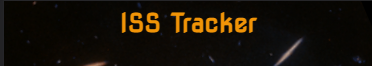

The logo is simply the title of the page. This is also a link to the Home page which can be easily accessed from anywhere within the site.

> ### Home page 
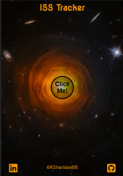

The home page features a spinning image of a star with a button in the center.
There is a logo at the top and a footer at the bottom, if you click the 'click me' button you will begin to interact with the many sections available.

> ### Footer 
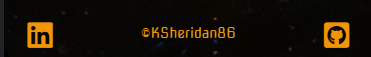

The Footer includes all my social media links and a link to my email.

> ### Info Window 
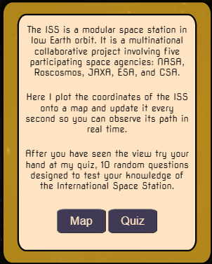

The info window pops up after you click the 'click me' button on the homepage, from here you get a little information about the ISS and the site itself.

> ### Map Window  
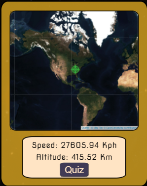

The map window contains a leaflet.js map that updates every second with the current location of the ISS.
There is also a box that holds constantly updated data about the ISS, namely Speed and Altitude and a button to access the quiz.

> ### Quiz Window []
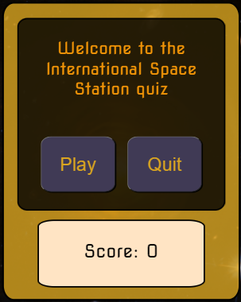

The quiz window gives you the option to play the game or quit.
The box that held info about the ISS is now occupied by the current score.

[Back to the Top](#table-of-contents)

---

## Future features

I would like to add some extra features to this project but i did not have the time or knowledge to do this just yet.

### Approaching alert
I would like to allow the user to put in their own location and have the website inform them when or if the ISS will be passing overhead.

### Day and Night view
The ISS API already includes data that confirms if the ISS is in daylight or not, given this information i would like to swap out the map tiles from the regular satellite images to dark tiles that include street lights when the ISS is in the dark and vice versa.

---

## Testing

Testing was done in a number of ways.

 > #### Manual Testing
 
 This was undertaken by myself, my wife and a number of friends, aswell as the Code Institute slack channels.
 We tested all links to confirm they worked and opened on a new blank page and went where they were supposed to. Multiple devices were used to confirm the site worked as it should and it displayed correctly across different screen sizes and browsers.

 > #### Online Testing

 All code was run through a validator and returned zero errors.
 These validator sites were:

- [Jigsaw CSS validator](https://jigsaw.w3.org/css-validator/#validate_by_uri)
- [W3C HTML Validator](https://validator.w3.org/)
- [JSHint JavaScript validator](https://jshint.com/)

Screenshots of all these results can be found below.
All the warnings about unused variables can be ignored as these variables are used in other files.

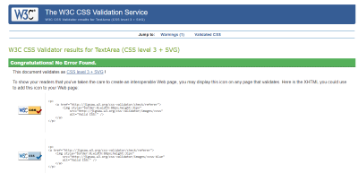
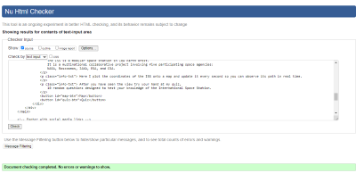
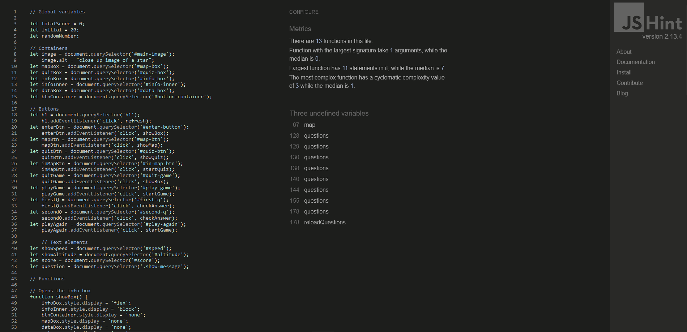
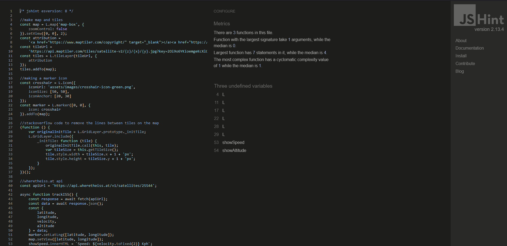
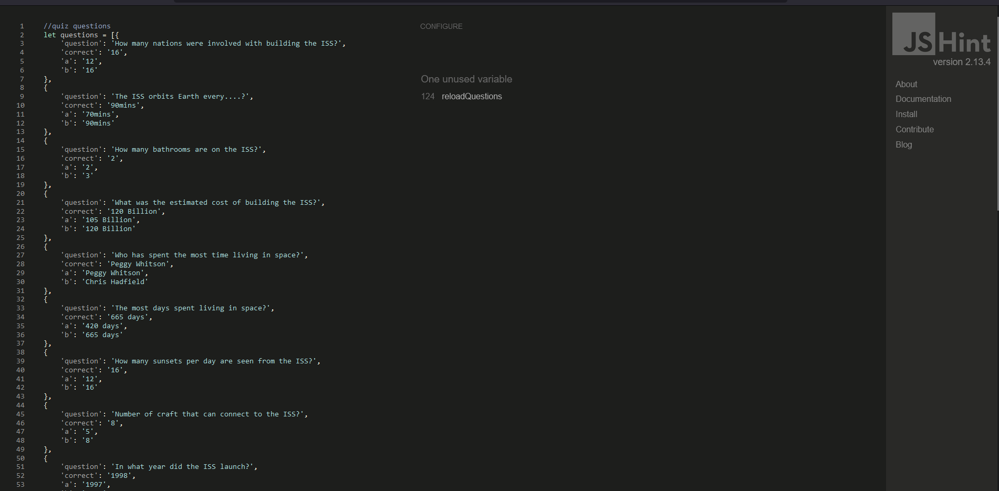

> #### Responsivity Testing

This website allowed me to select a number of devices with different size screens and viewports and see how my website looked on each of them.

- [Responsive Checker](https://responsivechecker.net/responsive)

> #### Google Lighthouse

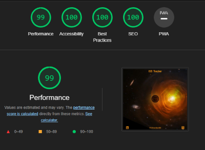 

> #### Errors

`Uncaught TypeError: Cannot read properties of undefined (reading 'target')`

Throughout the development of this project i kept receiving an error in the console relating to a javaScript function.
This function was passed an event and assigned it's value to a variable. 

It looks like this = `let clicked = event.target.innerText;`

The variable was then used to compare the users choice with the correct answer in the quiz.
Although this function worked perfectly the error persisted, my mentor could not figure out why, and the slack community couldn't help either,
so i had to contact tutor support to help with this issue.

In the end it turned out i was calling the function too early and there was no valid event data available, the quiz worked because the click event on the button also called the function and at that point there was event data to work with but the error persisted in the console every loop through the quiz until the early function call was removed.
It now works perfectly and there are zero errors.

[Back to the Top](#table-of-contents)

---

## Technologies

- [HTML](https://devdocs.io/html/)
- [CSS](https://www.w3.org/Style/CSS/Overview.en.html)
- [JavaScript](https://developer.mozilla.org/en-US/docs/Web/javascript)
- [GitHub](https://github.com/)
- [GitPod](https://www.gitpod.io/docs/)
- [Visual Studio Code](https://code.visualstudio.com/Docs)
- [Markdown](https://markdown-guide.readthedocs.io/en/latest/)
- [FontAwesome](https://fontawesome.com/docs)
- [Google fonts](https://fonts.google.com/)

#### Resources

- [Code Institute Curriculum](https://codeinstitute.net/ie/)
- [YouTube](https://www.youtube.com/)
- [Udemy](https://www.udemy.com/)
- [FreeCodeCamp](https://www.freecodecamp.org/)
- [W3Schools.com](https://www.w3schools.com/)
- [MDN Web Docs](https://developer.mozilla.org/en-US/)

[Back to the Top](#table-of-contents)

---

## Clone, Fork and Deploy

The steps below will outline how to clone fork and deploy this repository.
These steps assume that you have a GitHub/GitPod account, if not please start [here](https://www.github.com) by creating a GitHub account and [here](https://www.gitpod.io/docs/) by creating a GitPod account and installing the GitPod extension.

### Cloning

To clone this repository just follow the steps below.

- Navigate to the Repositories section in my GitHub portfolio.
- Click on the Repository you want to clone (project-2-ISS-tracker-quiz).
- Click the button labeled "Code" and copy the link shown.
- Open a new folder or your prefered location in your GitPod workspace.
- Type "git clone" into the terminal, paste the link and click Enter.
- Job done, you have created a clone of this repository.

### Fork this repository

To fork this repository just follow the steps below.

- Navigate to the repository you wish to fork.
- On the top right of the page click on the button marked "fork".
- The repository has now been cloned and you can find it in your account.

### Deployment

This project was deployed using GitHub pages.
The procedure for doing this is very straight forward.

- Inside the repository click on the button marked "Settings".
- In the side bar on the left click on the button marked "Pages".
- Under the source title you have two drop down menus, make sure the first is set to "Main" and the second to "Root" and click "Save".
- Within a couple of minutes the site was live and I received a notification indicating the url.
 

[Back to the Top](#table-of-contents)

---

## Credits

Only two images were used across this site, the first is the home page image, it was taken from hubble telescopes official website which allows for free use of their content for education purposes and even commercial purposes once the correct credit is given.
The second is the crosshair image used in the map and this was taken from wikimedia commons and is also free to use.

- [HubbleSite](https://hubblesite.org/)
- [wikimedia](https://commons.wikimedia.org/wiki/File:Antu_crosshairs.svg)

`"Unless otherwise specifically stated, no claim to copyright is being asserted by STScI and material on this site may be freely used as in the public domain in accordance with NASA's contract. However, it is requested that in any subsequent use of this work NASA and STScI be given appropriate acknowledgement."`

The map is from leafletjs.com, I followed their quick start guide to get it working, it was very straight forward.

- [leafletjs](https://leafletjs.com/SlavaUkraini/examples/quick-start/)

The API used to plot the coordinates of the ISS onto the map was wheretheiss.at, by following their docs I found it very straight forward to use.

- [ISS-API](https://wheretheiss.at/w/developer)

I used a function that i found on StackOverflow to remove the lines between the tiles on the map, this is stated above the function in the map-api.js file.

[Back to the Top](#table-of-contents)

---

## Acknowledgements
I would like to acknowledge the help and support given by my mentor Chris Quinn, all of the students in my own study group aswell as all the students in the wider Code Institute Slack channels. My cohort Facilitator Kasia Bogucka and all of the staff at Code Institute.
The sense of comraderie among all of these individuals has helped me to feel at home on my journey to a new career in programming.

[Back to the Top](#table-of-contents)

---

## Author Info

- [GitHub](https://github.com/KSheridan86)
- [Linkedin](https://www.linkedin.com/in/kensheridan86/)

[Back to the Top](#table-of-contents)